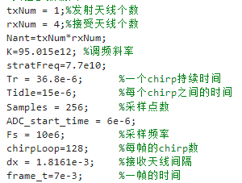

参考网址：[mmwave参数使用](https://e2e.ti.com/support/sensors-group/sensors/f/sensors-forum/864499/mmwave-studio-sensors-configuration-selection-and-significance-in-the-sensor-configuration-tab)和[mmwave波形设计](https://blog.csdn.net/weixin_45696224/article/details/130044531)

主要参数设置如下：

</img>
  
