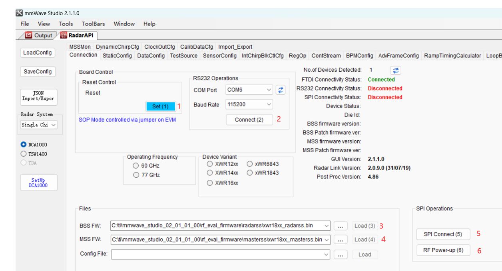

# 一 软件准备
## 1.1 安装mmWaveStudio
下载软件：[mmWaveStudio](https://www.ti.com.cn/tool/cn/MMWAVE-STUDIO#downloads).
> MMWAVE-STUDIO — 用于第 1 代部件 (xWR1243、xWR1443、xWR1642、xWR1843、xWR6843、xWR6443) 的 mmWave Studio GUI 工具

下载后默认安装即可，也可更改存储地址
## 1.2 安装R2015a runtime
这是安装环境，下载地址：[matlab-runtime](https://ww2.mathworks.cn/products/compiler/matlab-runtime.html)
> R2015aSP1 (8.5.1) 1 32bit

下载后默认安装即可
<!---
# 安装Microsoft Visual C++ 2013
用于c++编写，下载地址：[Microsoft Visual C++](https://support.microsoft.com/en-us/topic/update-for-visual-c-2013-and-visual-c-redistributable-package-5b2ac5ab-4139-8acc-08e2-9578ec9b2cf1)
> English - United States    https://download.microsoft.com/download/0/5/6/056DCDA9-D667-4E27-8001-8A0C6971D6B1/vcredist_x64.exe
-->
## 1.3 xds110驱动
下载[xds110驱动](https://software-dl.ti.com/ccs/esd/documents/xdsdebugprobes/emu_xds_software_package_download.html)
> XDS110 Support Utilities windows

## 1.4 关闭防火墙
windows11系统直接在搜索栏搜索：**windows defender 防火墙**，然后点击左侧的**启用或关闭Windows Defender 防火墙**，如图操作

</img>
  

# 二 设备调试
## 2.1 硬件组装
将雷达与DCA1000连接，如图所示：  

</img>

## 2.2 模式调整
AWR1843BOOST中S2开关调整为SPI模式，雷达板上的拨码调为011（SOP2为高位）  

</img>

将DCA1000上数据位数拨为16位  

</img>

## 2.3 查看端口
将DCA1000连接电源，将两个usb口、网线连接电脑，进入设备管理器，查看串口，如图所示即算连接成功  

</img>

将端口波特率设为115200

## 2.4 电脑IP调整
win10操作：网络和 Internet 设置->找到高级网络设置->更多网络适配器选项->以太网->属性->Internet 协议版本 4 (TCP/IPv4)，将地址修改为：
> IP地址：192.168.33.30  
> 子网掩码：255.255.255.0

并且虽然之后可以看到FPGA的IP地址为**192.168.33.180**，但是却会ping不通
## 2.5 连接电脑
打开软件，出现软件出现以下界面，按顺序操作  

</img>
  
在操作时，可以将output放在屏幕右侧，观察工作台输出，如图  

</img>
 
连接后，所有状态变为绿色  

</img>

# 三 数据配置与采集
## 3.1 Static config
操作顺序如图  

</img>

> 在Channel Config中选择相应的接收和发射天线数  
> 在Advanced Configuration ，如果电路板提供1V RF电源，勾选RF LDO Bypass Enable；如果是1.3V的就不用勾选。点击set。  
> 在LP Mode 中选择相应的LP ADC Mode。Low Power ADC适用于xWR1642，Regular ADC适用于AWR1243和xWR1443。点击set。
## 3.2 Date Config
操作顺序如图  

</img>
  

> 在LVDS Lane Configuration中选择相应的通道。xWR1642支持最多两个通道，AWR1243和xWR1443最多支持4通道。点击set。
## 3.3 sensor config
在这里配置雷达波形，操作顺序如图  

</img>
  

在第五步点击最左侧的Set Up DCA1000后，点击弹窗中的connect，Reset and Configure，出现如下界面，表明FPGA Version正确。

</img>
  

> 点击Trigger Frame，LED灯DATA_TRAN_RPG绿光不停闪烁，表明正在获取数据。  
> 在数据获取结束之后，LED灯DATA_TRAN_RPG绿光闪烁一次，并保持常绿。表明数据获取成功。
## 3.4 result
点击PostProc，出现如下结果,即表示这次测试成功：

</img>
  

# 参考资料
>	《mmwave_studio_user_guide》---讲软件如何使用  
>	[DCA1000EVM用户指南----讲硬件如何设置](https://e2echina.ti.com/blogs_/b/the_process/posts/dca1000evm)  
>	[雷达数据采集DCA1000EVM使用指南](https://blog.csdn.net/bigData1994pb/article/details/117112725)  
>	[使用TI AWR1843 Boost EVM和 DCA1000 EVM 实时采集ADC数据并解析_ti awr1843—使用MATLAB控制](https://blog.csdn.net/u011736505/article/details/117808754)  
>	[Xiaojie雷达之路---TI实战笔记---对AWR1843+DCA1000采集的数据进行解析](https://blog.csdn.net/Xiao_Jie123/article/details/112028352)  
